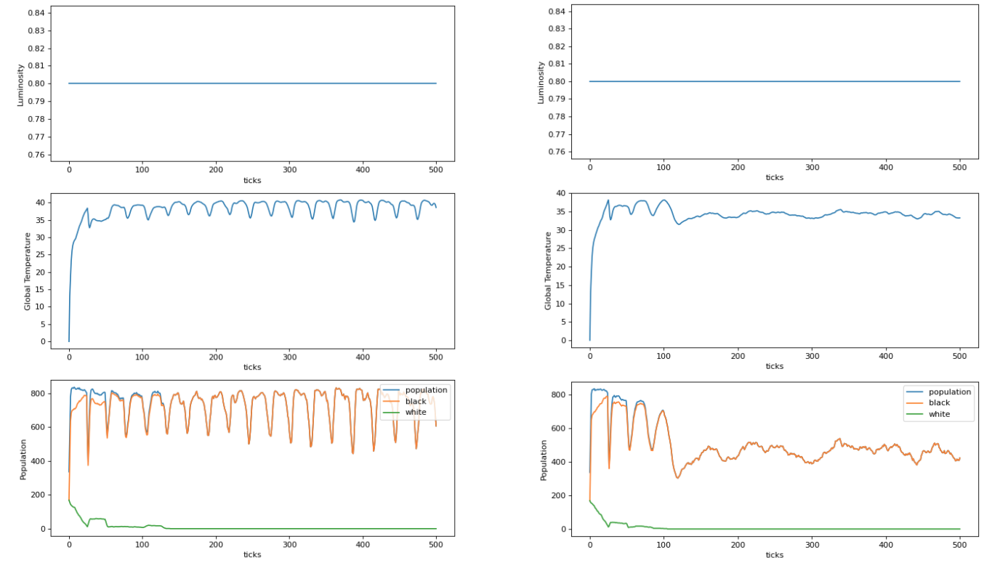

# DaisyWorld
Wenhao Zhang, 970012  
Xin Li, 956468  
Juntao Wu, 936983  

## Daisy World Background
The aim of this study is to replicate and extend a complex system and compare the difference between the replication and
the original model to ensure that model behaviour is independent of any implementation details specific to a particular programming language.  
Daisy world is replicated in the experiments, which explored the mutual relation between the living organisms - black 
daisies and white daisies and the non-living climate - temperature.  
The original daisy world model includes the following components:
* Two types of Daisies (Black and white)
* Temperature
* Solar Luminosity
* Other parameters: daisies albedo, surface albedo

The **mutual relation** between daisies and temperature:
Black daisies will warm up the surrounding patches’ temperature and the white daisies will cool down the surrounding 
patches’ temperature. Temperature also influences the reproduction of daisies, which means that the growth of new daisies
can only occur within this temperature range. Besides, the world scenario also affects world temperature. A higher solar
luminosity leads to a higher temperature which is more suitable for the white daisies survival and the lower solar luminosity
contributes to a lower temperature which is more suitable for the black daisies.  

After the initialization of turtles and patches, in every tick, the daisies absorb energy (temperature) from their neighbours 
and based on the temperature range, the daisies are more likely or unlikely to sow and reproduce. The relationship is very 
complex which makes the result unpredictable. In addition, there are multiple scenarios in this model,
with the ramp-up and ramp-down of the solar luminosity, the temperature is changing which leads to the change of the ability 
of daisies reproduction and the eventual stability of the temperature and the population of daisies.

## Original Model Analysis 
There are two scenarios considered in the experiments of the NetLogo model. 
### Fixed Solar Luminosity
* Set $solar-luminosity = 0.8$ (low)
* Set $solar-luminosity = 1.0$ (medium)
* Set $solar-luminosity = 1.2$ (medium-high)
* Set $solar-luminosity = 1.4$ (high)

Via the tool `BehaviorSpace` in NetLogo, set the "variable" `["solar-luminosity" 0.8 1.0 1.2 1.4]` with the “time limit” 
`500` and `1000` and “repetition” `20`, the results are shown below.  
<div style="text-align: center;">Table 1: NetLogo model result with fixed solar-luminosity</div>  


<small><center>The table shows the average value after 20 repetitions for accuracy purpose.</center></small>

### Ramp-up-ramp-down Luminosity
The solar luminosity remains 0.8 in first 200 ticks, it linearly increases until 1.79 between tick 200-400.

<div style="text-align: center;">Table 2: NetLogo model result with Ramp-up ramp-down solar luminosity</div>


<small>The number of black daisies turns to be zero after 400 ticks, it’s unnecessary to display the statistics after 400 tick.</small>

Daisies reflect solar energy from the sunlight thus keeping the temperature of the earth to a certain range of degrees. 
Running the original Netlogo using a constant solar luminosity of 0.8 with all other default settings, we can achieve a 
global temperature of around 40 degrees at tick 1000 and the black daisies can survive for an unlimited time. Likewise, 
if we use a higher constant solar luminosity (1.4), the white daisies survive forever and keep the global temperature at 
around 6 degrees. 

## Python Replication
We used Python to replicate the daisy world which has exactly two types of daisies and one factor that affects the world, 
the sunlight.

### Python function and classes
* `main.py`   
The main function which reads the configurable parameters from a json file, initializes and runs the daisy world program.

* `world.py`  
The class World is the implementation of the daisy world system, in which the run function will run the world for a tick. In each tick, the temperature of all patches is calculated based on the absorbed solar energy and diffusion of its neighbours. The world also calls the patch to update the state of the daisy that is growing on it. It also collects the statistics of every tick, which will be output to a csv file as the result.

* `patch.py`  
The class Patch is the implementation of patch instances, its important attributes include the temperature, the type of daisy, age of daisy and so forth. The individual patch updates its temperature and sprouts a daisy with a parabolic probability of which the peak value achieved at 22.5 degrees. The daisy growing on the patch will age by each tick and die when reaching its maximum age.

### Configuration
The configuration is defined in a json file, in which the input parameters can be customised accordingly.
* `tick`: the tick number that program will run
* `mode`: optional modes are “standard” and “ramp-up-ramp-down”
* `soil-quality-mode`: set to true or false to switch whether to turn on the extension feature
* `white-start`, `black-start`: initial rate of number of white and black daisies respectively.
* `white-albedo`, `black-albedo`, `surface-albedo`: albedo of white daisy, black daisy and patch surface respectively.

### How to Run
Run with the main function with the configuration file as the parameter, output the result in `result.csv`, for example:

```
python main.py standard.json
```

Configuration for ramp-up-ramp-down mode and new feature mode are provided in `ramp-up-ramp-down.json` and `new-features.json`. 
Noted that the configuration file must be in the same folder with `main.py`.

### Result Analysis
By running the script `multiple_run.py`, we can repeatedly generate running results, which are shown below: 
#### Fix Luminosity

<center>Table 3: Replicated model result with fixed solar-luminosity</center>


In the comparison, the number of turtles and the temperature of the replication model is approximate to the original model
in every tick span.  
The following figures show that the trend of the global temperature and population of turtles also resembles the original model. 

<center>Example1: Fixed solar-luminosity = 0.8, ticks = 1000</center>


<small>The left diagrams are generated by `matplotlib` using the `csv` output data</small>

#### Ramp-up-ramp-down Luminosity
<center>Table 4: Replicated model result with Ramp-up ramp-down solar luminosity</center>


<center>Example 2: Ramp-up ramp-down solar luminosity, ticks = 400</center>


In this scenario, when the temperature is low in the beginning, black daisies warm up the surrounding patches 
so that it has higher probability to propagate than white daisies. Meanwhile the number of white daisies decreases gradually.
From tick 200 ticks, the solar luminosity linearly increases and the growing trend is the opposite to the early stage.
At around 340 ticks, all of the black daisies will die and not be able to reproduce.

The replication model displays the same behaviours with the original model which confirms the correctness of the replication model.

## Extension Feature: Soil Quality
Soil quality attribute is added to the extended model.  
The patch with a better soil quality has a higher probability to grow a daisy, meanwhile a growing daisy lowers the soil 
quality by each tick.

### Hypothesis
The probability of an empty patch can grow the seed from neighbors will be affected by the soil quality factor, which will 
be generally lower than the original model. As a result, comparing to the original model, the changing of population and global temperature should be less sharp,
and its fluctuation should be more stochastic(not periodic), because patches has different soil quality value and it's more
difficult to grow a new daisy.

### Implementation
`soil_quality` is an instance variable of the class `Patch`, and it is a floating-point number in the range of [0,1]. It 
increases by 0.01 when no daisy is growing and degrades by 0.01 when a daisy growing. The probability for a patch to obtain 
seed from neighbours, which is calculated by temperature should multiply this factor to get an ultimate probability.

### Result Analysis
#### Fixed Solar Luminosity
<center>Example 3: Comparison between the standard model(left) and the extended model(right)</center>



#### Ramp-up-ramp-down Luminosity
<center>Example 4: Comparison between the standard model(left) and the extended model(right)</center>


From the comparison result we can see:
* The population of daisies is generally smaller and the fluctuation is more stochastic, in ramp-up-ramp-down scenario, white
daisies extinct before 200 ticks, because soil degradation makes it difficult to grow new daisies. 

* The soil quality also affects the temperature indirectly, the temperature is changing less sharply than the standard model,
and more stochastic.

In general, the extended model is consistent with our hypothesis.

## Appendix

* task allocation

| member    |  task    |
| ---- | ---- |
|  Wenhao Zhang  |  Model implementation, proofread report |
|  Xin Li    |  Experiment design, data analysis, report writing |
|  Juntao Wu    | Code refactoring, new feature design and implementation |

